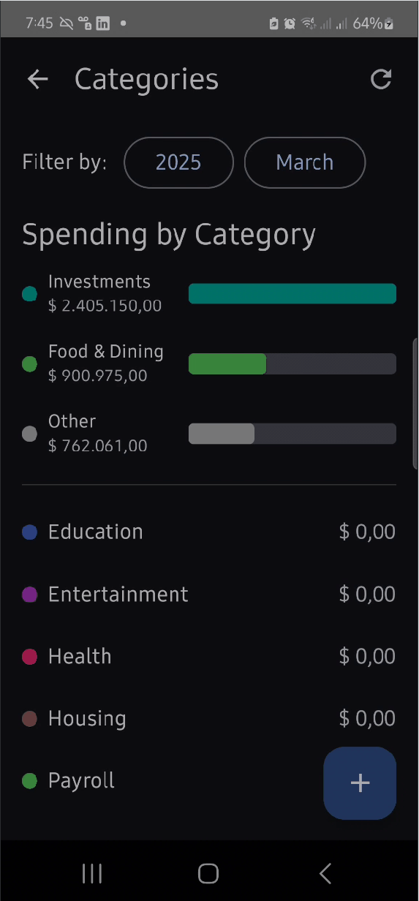

# Finanzas Personales

A Colombian SMS-based finance tracker for Bancolombia & Nequi transactions

<p align="center">
  
</p>


## 🎉 Recent Updates

### New Dashboard Home Screen
- Added a proper dashboard landing page with financial summary
- Shows monthly expense and income metrics at a glance
- Provides quick access to all key app features
- Displays recent transactions for quick review

### SMS Transaction Detection System
- Implemented real-time SMS processing for financial messages
- Added transaction parsing with improved detection algorithms
- Created permission handling system for seamless setup
- Added testing interface for SMS detection

### Rule-based Categorization System
- Added persistent rules for automatic transaction categorization
- Implemented rule matching based on transaction patterns
- Created default rules for common merchants and transaction types
- Added ability to create custom rules from past transactions

## ✅ Implemented Features

- **SMS Processing**
  - Reads Bancolombia/Nequi messages
  - Extracts COP amounts with regex
  - Parses dates from message text
  - Detects income via "recibiste" keyword

- **Transaction UI**
  - Material3-styled lists
  - Sort by date/amount (asc/desc)
  - Filter by year/month
  - Basic total calculations

- **Technical Base**
  - Jetpack Compose (BOM 2024.06.00 + Material3 1.2.1)
  - Kotlin 2.0 + JDK 17 (targeting JVM 11)
  - Gradle Version Catalog
  - SMS permission runtime request

## 📥 Installation

```bash
git clone https://github.com/jstello/SMS-finance.git
```
**Requirements:**
- Android Studio 2022.1+
- API 24+ device/emulator

### 🔧 Using Your Own Firebase (Optional, for Privacy)

If you'd like to run the app locally without sharing any data with the main project's Firebase backend, you can easily set up your own! This ensures your SMS data and transaction history stay completely private to your device and your own Firebase instance.

Here's how:

1.  Visit the [Firebase console](https://console.firebase.google.com/) and create a new Firebase project (or use an existing one).
2.  Inside your project, register a new Android app.
3.  Make sure to use the package name: `com.example.finanzaspersonales`.
4.  Download the `google-services.json` configuration file that Firebase provides.
5.  Place this downloaded file directly into the `app/` folder of your cloned project.

That's it! When you build and run, the app will automatically connect to *your* private Firebase project.

## ⚙️ Code Verified

- **Dependencies**
```kotlin
// Compose BOM + Material3
implementation(platform("androidx.compose:compose-bom:2024.06.00"))
implementation(libs.androidx.material3) // 1.2.1
implementation(libs.androidx.material.icons.extended) // 1.6.7

// Firebase (via BOM)
implementation(platform("com.google.firebase:firebase-bom:33.1.1"))
implementation("com.google.firebase:firebase-auth-ktx")
implementation("com.google.firebase:firebase-firestore-ktx")
```

- **Architecture**
  - Single Activity
  - Composable-based UI
  - State hoisting
  - Remember/MutableState

## 🚧 Current Limitations

- **Currency**
  - COP only
  - No USD support

- **Analysis**
  - No charts/graphs
  - Basic totals only

- **Localization**
  - Spanish SMS only

## 🌟 Future Enhancements

- **Visual Analytics & Insights**
  - Integrate charts and graphs for spending habits and trends.
  - Implement budgeting tools to track spending against set budgets.

- **Notifications & Reminders**
  - Notify users of large transactions or when spending exceeds thresholds.
  - Send monthly summaries highlighting key financial insights.

- **Cloud Sync & Backup**
  - Store transactions securely in the cloud for cross-device synchronization.
  - Allow users to backup and restore their transaction history easily.

- **User Authentication & Security**
  - Implement secure authentication methods (email/password, OAuth).
  - Ensure sensitive financial data is encrypted.

- **Receipt Management**
  - Allow users to attach photos of receipts to transactions.
  - Use OCR to automatically extract transaction details from receipt images.

- **Multi-Currency Support**
  - Automatically convert transactions to different currencies based on real-time exchange rates.

- **Transaction Categorization**
  - Use machine learning to automatically categorize transactions.
  - Allow users to create and manage their own categories.

- **Scheduled Transactions**
  - Track and remind users of upcoming recurring payments.

- **Advanced Search & Filtering**
  - Enhance search capabilities to filter transactions by various criteria.

- **Export & Reporting**
  - Allow users to export transaction data for external analysis.
  - Generate tax reports formatted for easy submission.

- **Widgets & Quick Actions**
  - Provide home screen widgets for quick access to recent transactions.

- **Integration with Financial APIs**
  - Directly integrate with banking APIs for real-time data.

- **Collaboration Features**
  - Allow multiple users to manage shared finances collaboratively.
